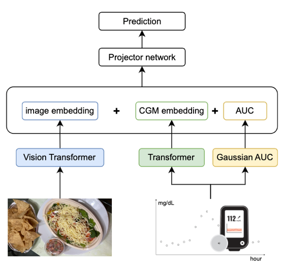

# Joint Embedding of Food Photographs and Blood Glucose for Improved Calorie Estimation (BHI 2023)

This is the code Implementation for our accepted IEEE BHI-2023 manuscript: `Joint Embedding of Food Photographs and Blood Glucose for Improved Calorie Estimation` (link to [paper](https://doi.org/10.1109/BHI58575.2023.10313421)).

Corresponding Author: [Sicong Huang](mailto:siconghuang@tamu.edu).

## Description

Type 2 diabetes has a significant impact on individuals’ health and well-being, and diet monitoring is an important tool in treating individuals. Accurate estimation of meal intake is essential for promoting diet and behavior interventions. While continuous glucose models (CGMs) have demonstrated the ability to estimate carbohydrate quantities in meals, CGMs-alone have been insufficient in capturing other meal nutritional information due to the different types of food and people’s health conditions. Therefore, we propose a multi-modality model for augmenting CGM-based inverse metabolic models by using both CGMcaptured interstitial glucose data and food image data. A late fusion approach is used to aggregate the extracted glucose information from the attention-based Transformer and Gaussian area under the curve (gAUC) features, and image information from the vision transformer. We test our model on a dataset collecting Freestyle Libre Pro CGM data and meal photographs of breakfasts and lunches on 27 participants, with meals with known fixed caloric content. Our joint embedded approach to learning calorie estimations from both CGM data and image data achieved an average Normalized Root Mean Squared Error (NRMSE) of 0.34 for calorie prediction, with a correlation of 0.52, a 15.0% improvement over CGM-only models and 17.1% over image-only models.

## Prerequisites

### Setup Environment

Our experiments are conducted on a Linux-based machine with the following specifications:

* Linux-based OS (Ubuntu 20.04.3 LTS)
* Python 3.9.15
* conda 4.14.0
* PyTorch 1.11.0
* git 2.25.1
* CUDA 11.4 or 11.6 (for GPU acceleration)

We highly recommend you to use our shared conda environment [`torch_env.yml`](torch_env.yml) we shared to avoid potential compatibility issue. To setup Conda for your computer, you can follow the instructions [here](https://conda.io/projects/conda/en/latest/user-guide/install/index.html).

Command Line Input Steps:

1. `git pull https://github.com/stmilab/joint_embedding_calorie_prediction.git` clones the repository to your local machine

2. `cd joint_embedding_calorie_prediction/` changes the directory to the repository

3. `conda env create -f torch_env.yml` creates a new conda environment same as ours (`torch_env.yml` contains the packages used for our experiments.)

4. `conda activate torch_env` activates the created conda environment you just created

## Implementations

our model has three sub-neural networks:

* time-series embedding extractor
* image embedding extractor
* calorie predictor

### Joint Embedding Framework

* `models/lstm.py` and `models/transformer.py` are the time-series embedding extractors of our proposed joint embedding framework.
* `models/vgg.py` and `models/vision_transformer.py` are the image embedding extractors of our proposed joint embedding framework.

### Training and Evaluation

`calorie_predictor.py` is the calorie predictor of our proposed joint embedding framework.

### Hyperparameter Tuning

`hyperparam.txt` contains the hyperparameters we used for our experiments. We used [weights & bias](https://wandb.ai/) to track the hyperparameter sweep.

## Datasets

We are still collecting more data for our study. We will release the dataset once we have finished the data collection.
If you are interested in our dataset, please contact [Dr. Bobak Mortazavi](mailto:bobakm@tamu.edu) for more details.

## Evaluation

`utils/torch_metrics.py` contains various evaluation metrics implemented and ready to used:

* Root Mean Squared Error (RMSE)
* Root Mean Squared Relative Error (RMSRE)
* Mean Absolute Error (MAE)
* Pearson's Correlation Coefficient (R)
